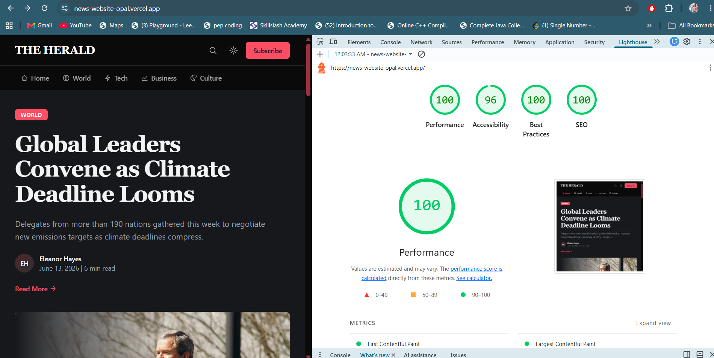
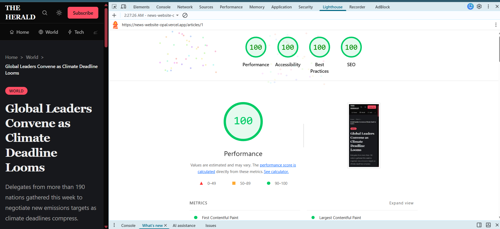

# News Website

A responsive news website built with Next.js 16, React 19, TypeScript, Tailwind CSS v4, and a mock news API. The app renders a homepage, section landing pages, and dynamic article pages using shared editorial data.

## What This App Is

This project is a multi-page news website for browsing editorial content across sections such as `World`, `Tech`, `Business`, and `Culture`.

Key user-facing features:

- Homepage with hero story, top stories, latest headlines, and editor's picks
- Section pages for curated topic coverage
- Dynamic article detail pages at `/articles/[articleId]`
- Responsive layout for mobile, tablet, and desktop
- Light and dark theme support

## Tech Stack

- Next.js 16 App Router
- React 19
- TypeScript
- Tailwind CSS v4
- `next-themes` for theme switching
- `json-server` for local mock API data
- Postman Mock Server support for hosted mock data

## Project Structure

```text
src/
  app/                 App Router routes and layout
  components/          Reusable UI components
  lib/api/             API access layer for news data
  lib/                 shared config, SVGs, and utilities
  providers/           App providers
  types/               Shared TypeScript types
mocks/
  news-db.json         Mock news content
docs/
  screenshots/         Lighthouse screenshots to attach in README
```

## How To Run

### 1. Clone the repository

```bash
git clone https://github.com/saumya673/news-website.git
cd news-website
```

### 2. Install dependencies

```bash
pnpm install
```

### 3. Create the environment file

macOS/Linux:

```bash
cp .env.local.example .env.local
```

Windows PowerShell:

```powershell
Copy-Item .env.local.example .env.local
```

Windows Command Prompt:

```bat
copy .env.local.example .env.local
```

Then configure one of the mock API modes below.

### 4. Start the app

```bash
pnpm dev
```

Open `http://localhost:3000`.

## Environment Variables

The app reads server-side env vars from the project root `.env.local`.

```env
NEWS_API_BASE_URL=
NEWS_API_DATA_PATH=
```

### Hosted mock API mode: Postman Mock Server or your own API

Use this when your news data is served from a hosted endpoint as one JSON document. You can either:

- create a Postman Mock Server
- create your own API and point the app to it

As long as the endpoint returns the same data shape, the app will work with either option.

Example:

```env
NEWS_API_BASE_URL=https://<your-mock-id>.mock.pstmn.io
NEWS_API_DATA_PATH=/news
```

How it works:

- `NEWS_API_BASE_URL` points to your hosted mock server or custom API
- `NEWS_API_DATA_PATH=/news` tells the app to fetch one aggregated document
- That document contains `articles`, `hero`, `topStories`, `latestHeadlines`, and `editorPicks`

### Local mock API mode: json-server

Use this when you want to serve data locally from `mocks/news-db.json`.

`.env.local`

```env
NEWS_API_BASE_URL=http://127.0.0.1:3001
# Leave NEWS_API_DATA_PATH empty or remove it for local mode
```

Start the local mock API in a separate terminal:

```bash
pnpm mock:api
```

Then run the app:

```bash
pnpm dev
```

## Architecture Decisions

### 1. App Router with server-first data fetching

The app uses the Next.js App Router and fetches content on the server through `src/lib/api/news.ts`. This keeps API access centralized and avoids duplicating fetch logic across pages and components.

### 2. Single API abstraction for two mock modes

The API layer supports both:

- local collection-based `json-server` endpoints such as `/articles`
- hosted Postman single-document mode via `NEWS_API_DATA_PATH=/news`

This makes it easy to switch between local development and an externally hosted mock server without changing page components.

### 3. Reusable editorial components

Homepage rails, cards, story hero blocks, and section layouts are split into reusable components so the content model stays consistent across routes.

### 4. Config-driven section pages

Section pages share a common layout and use central configuration from `src/lib/section-pages.tsx` for metadata, copy, and visual treatment. This avoids duplicating page structure for each section.

### 5. Theme-aware styling

The UI uses Tailwind utilities with shared theme tokens and `next-themes` for light/dark support instead of hard-coded one-theme styling.

## Trade-offs

- The project uses mock editorial data instead of a live news source so the focus stays on UI quality, component structure, and frontend performance.
- The hosted Postman mock mode returns a single aggregated payload, which keeps integration simple for the assignment but is less flexible than a more granular production API.
- Section pages are driven by shared configuration and reusable layouts, which improves consistency and speed of development, but limits per-section variation unless the config model is extended.
- The current content model is intentionally lightweight and optimized for the assignment scope rather than a full CMS-backed publishing workflow.

## Future Improvements

- Add Zod schemas for runtime API response validation and safer parsing of mock or hosted data.
- Add a `View All` experience for top stories so users can browse the full set beyond the homepage rail.
- Add search, filtering, and richer article discovery flows.
- Expand the article experience with related stories, author pages, and richer long-form content blocks.
- Add automated tests for the API layer, route rendering, and critical UI components.
- Refine accessibility further with deeper keyboard-flow, screen-reader, and reduced-motion audits.

## Available Routes

- `/` - homepage
- `/articles/1` - example article detail page
- `/world`
- `/tech`
- `/business`
- `/culture`
- `/about`
- `/contact`
- `/subscribe`
- `/press`
- `/careers`

## Lighthouse Report

Lighthouse was run against the deployed build on Vercel.

Pages measured:

- Home page: `/`
- Article page: `/articles/1`

### Scores

| Page                    | Performance | Accessibility | Best Practices | SEO |
| ----------------------- | ----------- | ------------- | -------------- | --- |
| Home (`/`)              | 100         | 96            | 100            | 91  |
| Article (`/articles/1`) | 100         | 100           | 100            | 100 |

### Screenshots

#### Home Page Lighthouse



#### Article Page Lighthouse



## Deployment

Live URL: `https://news-website-opal.vercel.app/`
